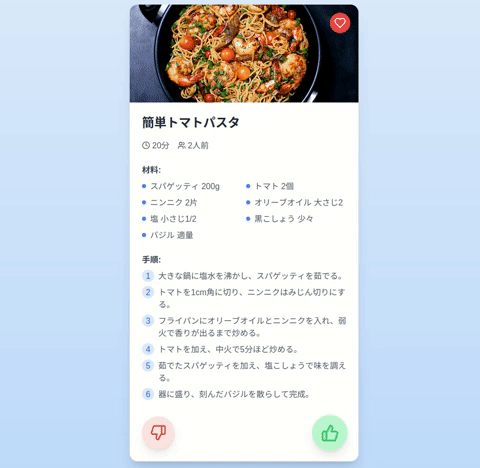

# RecipeSuggestionApp

This app reads ingredients from a photo of food and suggests recipes for dinner. You can select recipes with a flick gesture.




## Directory Structure

- **app/**: Main pages and layout of the application
  - `globals.css`: Global styles
  - `layout.tsx`: Layout component
  - `page.tsx`: Main page component
  - **api/**: API-related files
  - **components/**: Page-specific components
  - **data/**: Data-related files
- **components/**: Reusable components
  - `theme-provider.tsx`: Theme provider component
  - **ui/**: UI components
- **hooks/**: Custom hooks
  - `use-mobile.tsx`: Custom hook for mobile devices
  - `use-toast.ts`: Custom hook for toast notifications
- **lib/**: Utility functions
  - `utils.ts`: Utility functions
- **public/**: Public resources
  - `placeholder-logo.png`: Placeholder logo
- **styles/**: Stylesheets

## Technologies Used

- **Next.js**: React framework
- **Tailwind CSS**: Utility-first CSS framework
- **TypeScript**: Type-safe JavaScript

## Setup

Clone the project and install dependencies.

```sh
git clone <repository-url>
cd RecipeSuggestionApp
pnpm install
```

## Starting the Development Server

To start the development server, run the following command:

```sh
pnpm dev
```

You can check the app in your browser at `http://localhost:3000`.

## Build

To build the project, run the following command:

```sh
pnpm build
```

## License

This project is licensed under the [MIT License](./LICENSE).